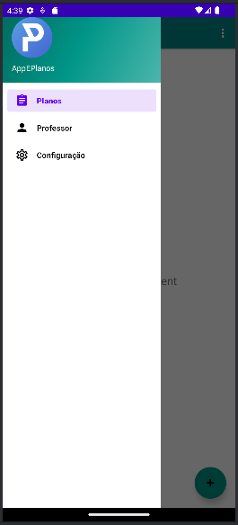
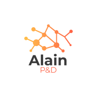

# E-Planos

Aplicativo para Plataforma Android desenvolvido em Kotlin, que permite a criação e gestão dos planos de aulas criados por professores.

### Tecnologia
Aqui estão as tecnologias utilizadas neste projeto.

* kotlin 1.9.0
* Android SDK 34

### Serviços Usados
* Github
* Android Studio

### Plataforma compatíveis
* Android

### Situação do Projeto
Projeto de software em andamento

### Interface

### Recursos
* Permite a criação de planos de aula por professores
* Gestão dos planos de aula pelos coordenadores

### Links
* [Repository](https://github.com/AlainMota9/EPlanos)
* [Facebook](https://www.facebook.com/alain.mota.3/)
* [Lattes](http://lattes.cnpq.br/9940114103826916)
* [linkedin](https://www.linkedin.com/in/alain-mota-a61319117/)

### Controle de versão
1.0.0.0

### Autor
Alain L. Mota: [@AlainMota](https://github.com/AlainMota9)

#### Obrigado pela Visita!

